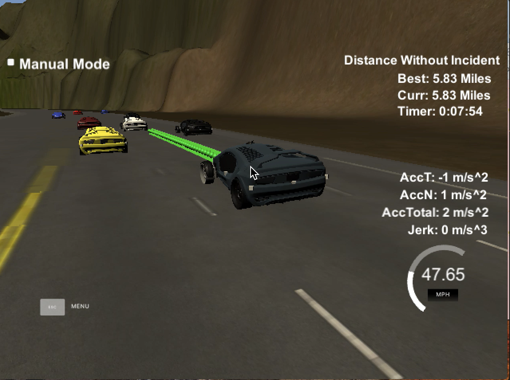

Write-up
1. Compiling
The code compiles without errors using cmake and make.



2. No accident
As shown in the video vid.mov, the car is able to drive at least 4.32 miles without incident.

3. Speed Limit
As shown in the video vid.mp4, the car drives according to the speed limit.

4. Shakiness
As shown in the video vid.mp4, max Acceleration and Jerk are not Exceeded.

4. Collisions
As shown in the video vid.mp4, the car drives without collisions

5. Lane Stability
As shown in the video vid.mp4, the car stays in its lane, except for the time between changing lanes.

6. Lane Changing
As shown in the video vid.mp4, the car is able to change lanes.

7. Reflection

All the code is in main.cpp. State struct is defined (line 173) to manage the data from everycar.\

The state struct has all the current states from the car (id, x, y, s, d, yaw, speed, lane, target_lane) and a ptr to another state struct that describes it's future predicted state. The path planner is serially structured in plan() with the following functions (line 515):
```
read_input(input);
check_nearby();
generate_spline_points();
create_spline();
fill_waypoints();
```

-read_input(input) parses the json into car(state struct)\
-check_nearby parses the sensor_fusion into each nearby_car. Then, for each, it checks if it is too close . is_too_close line 495 which checks if it in same lane and physically close. If one of them is close, then it slows down or tries to move with change_lanes(). change_lanes uses a simple huristic, but a objective function could be defined here instead.\
-generate_spline_points creates states based on previous paths and target lane for the car.\
-create_spline uses the spline (defined in spline.h) to create a trajectory.\
-fill_waypoints creates the waypoints based on the spline\
